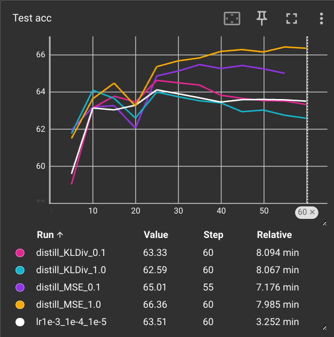

# model_compression
Exploring model compression techniques

### 1. Effect of pruning on interpretability using SHAP

- Code in [pruning_interpretability.ipynb](pruning_interpretability.ipynb)
- Network used: LeNet
- Dataset: Oxford-IIIT Pets 
- Interpretability technique examined: SHAP
- Structured pruning applied to convolutional & fully connected layers using `ln_structured()` function (available in PyTorch)
- Observation: After pruning, SHAP indicates lower confidence in the pixels that are considered 'relevant' for classification. However, upon fine-tuning the pruned network, the interpretability is regained - almost indistinguishable from the original network.

### 2. Exploring the usefulness of knowledge distillation

- Code in [knowledge_distillation.ipynb](knowledge_distillation.ipynb)
- Teacher network: ResNet18
- Student network: LeNet
- Dataset: CIFAR10
- Using the teacher network's logits in the distillation loss is effective (concluded after replacing teacher network's logits with random predictions)
- The following graph indicates that using MSELoss as a distillation loss is more effective than a KLDivergence loss for a typical image classification task (the various distillation experiments are compared with a vanilla learning rate scheduled training of the student network):
